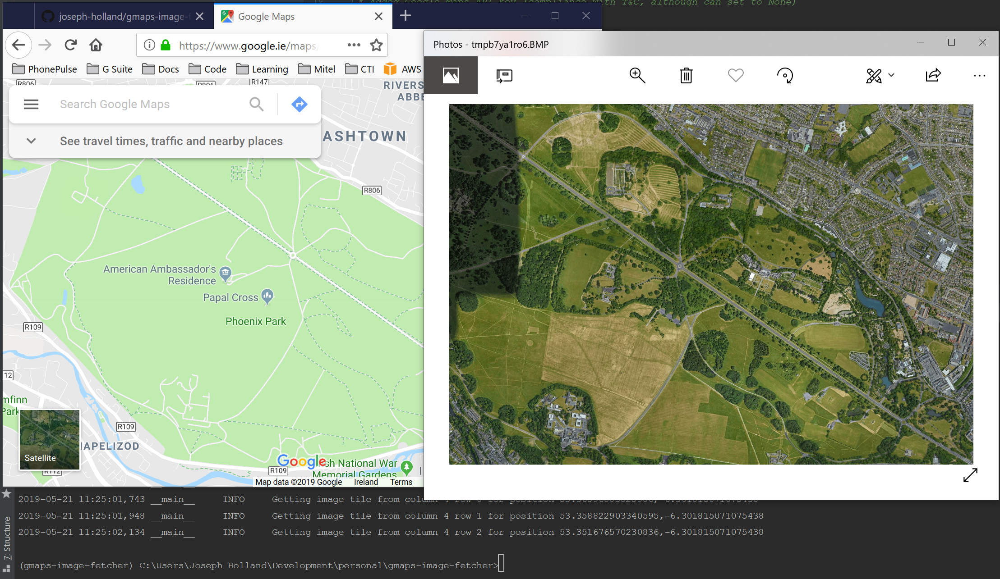

# GMaps Image Fetcher

Simple tool to download and stitch together image tiles from Google Maps via the Static-Maps API



## How it works

* Give the tool two sets of latitudes and longitudes for the north-west and south-east of the area you wish to download
the imagery from
* The tool calculates how many individual image tiles it needs to get from Google's Static-Maps API and begins to
download them
* All image tiles are stitched together and a preview showed onscreen
* The image is saved to a file in your chosen format (PNG, JPG, or BMP)

## Installation

### Prerequisites

* A GOOGLE_MAPS_API_KEY is required as per the T&Cs of Google's Static-Maps API (plenty of tutorials online showing you how to generate this, Google it)
* Please ensure to enable the Static Maps API also in your account

### Install from PyPI

```bash
pip install gmaps-image-fetcher
```

### Install from GitHub

```bash
pip install git+https://github.com/joseph-holland/gmaps-image-fetcher.git
```

## Running

1. Set your GOOGLE_MAPS_API_KEY environment variable

    Windows
    ```bash
    set GOOGLE_MAPS_API_KEY=AIzaS.............
    ```
    
    Linux/macOS
    ```bash
    export GOOGLE_MAPS_API_KEY=AIzaS.............
    ```
    
2. Run the tool and give it the NW lat/lon and SE lat/lon as well as a zoom level (1= world, 20=buildings)

    ```bash
    gmaps-image-fetcher -nw 53.369745 -6.348743 -se 53.348326 -6.296656 -z 16
    ```

3. The tool will calculate how many image tiles it will need to retrieve and prompt if you wish to continue

    ```bash
    Retrieve 15 image tiles from Google static-maps API
    Do you want to continue y/n: y
    ```

4. It will then download the image tiles, stitch them together, show the image onscreen and save to the local directory

    

## Command-line Options

| Option | Description |
|--------|-------------|
| `-nw`, `--northwest` | Northwest latitude/longitude coordinates |
| `-se`, `--southeast` | Southeast latitude/longitude coordinates |
| `-z`, `--zoom` | Zoom level from 1 (world) to 20+ (buildings), default is 18 |
| `-sc`, `--scale` | Scale factor for Google Maps API (1 or 2), default is 1, 2 is for high resolution |
| `-f`, `--format` | Output image format (png, jpg, bmp), default is png |
| `--delay` | Delay between API requests in seconds, default is 0.5; used in case of Google API rate limits |
| `-d`, `--debug` | Enable debug output |
| `-l`, `--logfile` | Logfile to write |
| `--version` | Show the version number and exit |

## Examples

Save a high-resolution image with scale factor 2:
```bash
gmaps-image-fetcher -nw 53.369745 -6.348743 -se 53.348326 -6.296656 -z 16 -sc 2
```

Save as JPEG format for smaller file size:
```bash
gmaps-image-fetcher -nw 53.369745 -6.348743 -se 53.348326 -6.296656 -z 16 -f jpg
```

Increase delay between API calls to avoid rate limits:
```bash
gmaps-image-fetcher -nw 53.369745 -6.348743 -se 53.348326 -6.296656 -z 16 --delay 1.0
```

## License

This project is licensed under the GNU General Public License v3.0 - see the [LICENSE](LICENSE) file for details.